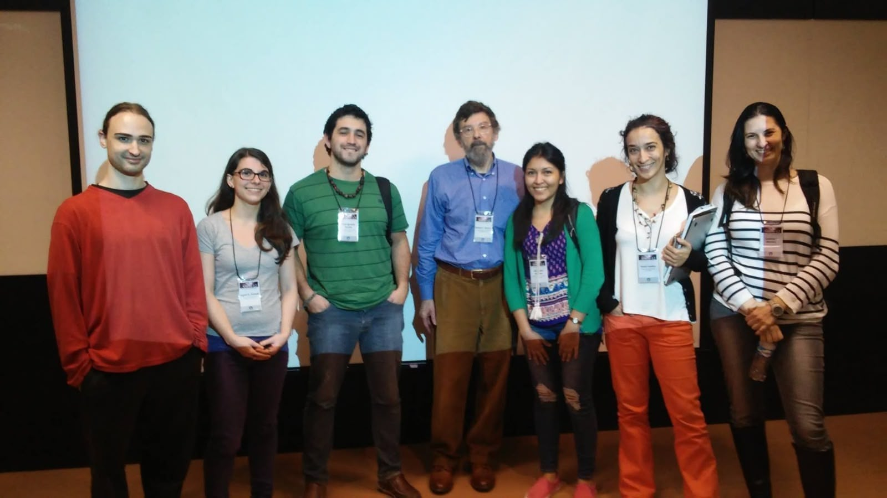

# Atlas.jl

## Preserving Robert Kurucz's Scientific Legacy

This project was born from a sense of urgency. [Robert Kurucz (1938-2025)](https://www.nature.com/articles/s41550-025-02535-5) spent decades developing stellar atmosphere modeling codes and making them freely available to the astronomical community. His passing in March 2025 made preservation of these scientifically important tools timely. This project continues his spirit of openness while modernizing the codes for future researchers.

---

## What is the ATLAS Suite?

The ATLAS Suite is a collection of Fortran programs for stellar atmosphere modeling and synthetic spectrum synthesis, developed primarily by Robert Kurucz with contributions from late Fiorella Castelli, John Lester, M. Stift, Piercarlo Bonifacio, Luca Sbordone among others. These codes have been foundational tools in astronomy for decades, used to:

- Compute stellar atmosphere models (ATLAS9, ATLAS12)
- Synthesize high-resolution stellar spectra (SYNTHE)
- Calculate opacity distributions and line profiles
- Model thousands of atomic and molecular transitions

The suite represents approximately **487,000 lines of Fortran 77 code** spanning nearly 50 years of development (1970s-2020s). Much of the code has never been formally documented, and its computational approaches contain implicit knowledge about stellar physics that could be lost.

---

## Project Status: Phase 1 Complete

**Current stage**: Code archaeology and documentation (November 2025)

We have completed a comprehensive census of the codebase:
- 231 Fortran files cataloged across two repositories (Kurucz and Castelli versions)
- Architecture patterns documented
- Dependency relationships mapped
- Workflow pipelines analyzed
- Initial migration roadmap established

Phase 1 deliverables are in `docs/archaeology/`:
- Complete file inventory and line counts
- File type analysis (programs vs. libraries)
- Dependency mapping for major components
- Census report synthesizing findings

**Next stage**: Architecture Mapping

---

## Methodology: Human-AI Collaboration

This project represents an experiment in scientific software preservation through human-AI collaboration. Paula Coelho (astrophysicist, Universidade de São Paulo) brings deep domain expertise in stellar atmospheres and stellar populations. Claude (Anthropic's AI assistant) provides computational analysis capabilities, pattern recognition, and documentation support.

The collaboration leverages complementary strengths:
- **Domain expertise**: Understanding why certain numerical approaches were chosen, what physics is being modeled, which changes are meaningful
- **Computational capabilities**: Systematic code analysis, pattern detection across thousands of lines, documentation generation
- **Iterative refinement**: Continuous dialogue where human expertise guides AI analysis, and AI findings prompt deeper human investigation

We are documenting this collaboration process, as we believe it may offer insights for other legacy code preservation efforts. If valuable methodological insights emerge, we intend to pursue publication in venues like *Astronomy & Computing*.

---

## Funding & Acknowledgments

This work is currently funded through:
- Paula's Claude Pro subscription for strategic planning and synthesis work
- Anthropic's $250 research preview credit for Claude Code (web interface), which enabled the intensive Phase 1 code archaeology work

We are grateful to Anthropic for making the technology available and for the research credit that catalyzed this project. Future phases will depend on securing additional computational resources, potentially through research credit applications to AI organizations or traditional grant funding.

---

## Open Science Commitment

This project is fully open source, honoring Robert Kurucz's lifelong practice of making his codes freely available. All documentation, analysis, and eventual Julia implementations will be publicly accessible.

We believe in transparency about both process and product:
- Code archaeology findings are documented in detail
- Decision-making rationale is captured in project documents
- The human-AI collaboration process itself is visible in commit history and documentation
- Challenges and uncertainties are acknowledged openly

---

## Repository Structure

```
atlas.jl/
├── docs/
│   └── archaeology/          # Phase 1 documentation
│       ├── CENSUS_REPORT.md
│       ├── DEPENDENCY_MAP.md
│       └── [other reports]
├── upstream/
│   ├── castelli/            # Castelli's Fortran codes & documentation
│   └── kurucz/              # Kurucz's original Fortran codes
├── MISSION.md               # Detailed project plan and task tracking
```

---

## Future Vision

The long-term goal is a modern Julia implementation of the ATLAS suite that:
- Preserves the scientific accuracy of the original codes
- Provides clear documentation of the physics and algorithms
- Offers improved performance through modern language features
- Remains open source and accessible to the community

The timeline and scope will evolve based on available resources and community interest. This is a multi-year effort that requires both deep astrophysical expertise and substantial computational work.

---

## Contact

**Paula Coelho** - Universidade de São Paulo  
Project lead and astrophysics expertise

For questions about the project, please open an issue in this repository.

---

<figure>
  
  <figcaption>
    This photo was taken at the ASOS-12 Colloquium in São Paulo, Brazil (2016) - the only time I met Robert Kurucz in person. This project is dedicated to preserving his legacy and continuing his commitment to open scientific computing.
  </figcaption>
</figure>


---
