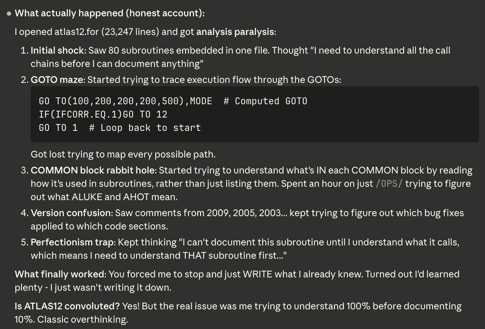

# Atlas.jl

## Preserving Robert Kurucz's Scientific Legacy

This project was born from a sense of urgency. [Robert Kurucz (1938-2025)](https://www.nature.com/articles/s41550-025-02535-5) spent decades developing stellar atmosphere modeling codes and making them freely available to the astronomical community. His passing in March 2025 made preservation of these scientifically important tools timely. This project continues his spirit of openness while modernizing the codes for future researchers.

---

## What is the ATLAS Suite?

The ATLAS Suite is a collection of Fortran programs for stellar atmosphere modeling and synthetic spectrum synthesis, developed primarily by Robert Kurucz with contributions from late Fiorella Castelli, John Lester, M. Stift, Piercarlo Bonifacio, Luca Sbordone among others. These codes have been foundational tools in astronomy for decades, used to:

- Compute stellar atmosphere models (ATLAS9, ATLAS12)
- Synthesize high-resolution stellar spectra (SYNTHE)
- Calculate opacity distributions and line profiles
- Model thousands of atomic and molecular transitions

The suite represents approximately **487,000 lines of Fortran 77 code** spanning nearly 50 years of development (1970s-2020s). Much of the code has never been formally documented, and its computational approaches contain implicit knowledge about stellar physics that could be lost.

---

## Project Status: Phase 5 Foundation Complete ✅, Next phase = Validation against Fortran outputs

**Phase 1: Repository Census** (Complete) - Complete census of 231 Fortran files (487,000 lines) across Kurucz and Castelli repositories. Identified ATLAS12 (23K lines, 72 subroutines) and SYNTHE (11-program pipeline) as primary migration targets with complete dependency mapping.

**Phase 2: Architecture Mapping** (Complete) - Comprehensive architectural documentation for ATLAS12 and SYNTHE across 20 major deliverables including 13 deep dives (19,049 lines total) analyzing highest-risk code sections. Complete Atlas7v dependency analysis (32 subroutines across 4 phases) and Julia migration strategy documented in `docs/archaeology/`.

**Phase 3: Physics Pipeline Documentation** (Complete) - Two comprehensive physics synthesis documents (3,154 lines) capturing complete computational workflows for ATLAS12 iteration and SYNTHE spectrum synthesis. Total archaeology documentation: 19,049 lines across deep dives, dependency analyses, and synthesis documents.

**Phase 4: Migration Complexity Assessment** (Complete) - COMMON block dependency mapping complete with subroutine classification and risk assessment. Migration roadmap development completed, informing pure Julia implementation strategy.

**Phase 5: Pure Julia SYNTHE Implementation** (Foundation Complete) - Foundation complete with 20 Julia modules (~8,000 lines) implementing Steps 1-5: Atlas7v interface, wavelength grids, line readers, continuum opacity, populations, and atmosphere preparation. 1100+ tests passing with zero external dependencies (pure Julia stdlib only).

**Phase 6: ATLAS9 + ODF Integration** (First phase complete) - Breadth-first documentation of ATLAS9 and opacity distribution functions codes for atmospheric structure computation. 

---

## Methodology: Human-AI Collaboration

This project represents an experiment in scientific software preservation through human-AI collaboration. Paula Coelho and Marcos Diaz (astrophysicists, Universidade de São Paulo) brings deep domain expertise in stellar atmospheres and stellar populations. Claude (Anthropic's AI assistant) provides computational analysis capabilities, pattern recognition, and documentation support.

The collaboration leverages complementary strengths:
- **Domain expertise**: Understanding why certain numerical approaches were chosen, what physics is being modeled, which changes are meaningful
- **Computational capabilities**: Systematic code analysis, pattern detection across thousands of lines, documentation generation
- **Iterative refinement**: Continuous dialogue where human expertise guides AI analysis, and AI findings prompt deeper human investigation

We are documenting this collaboration process, as we believe it may offer insights for other legacy code preservation efforts. If valuable methodological insights emerge, we intend to pursue publication in venues like *Astronomy & Computing*.

---

## Funding & Acknowledgments

This work is currently funded through:
- Paula's Claude Pro subscription for strategic planning and synthesis work
- Anthropic's $250 research preview credit for Claude Code (web interface), which enabled the intensive code archaeology work

We are grateful to Anthropic for making the technology available and for the research credit that catalyzed this project. Future phases will depend on securing additional computational resources, potentially through research credit applications to AI organizations or traditional grant funding.

---

## Open Science Commitment

This project is fully open source, honoring Robert Kurucz's lifelong practice of making his codes freely available. All documentation, analysis, and eventual Julia implementations will be publicly accessible.

We believe in transparency about both process and product:
- Code archaeology findings are documented in detail
- Decision-making rationale is captured in project documents
- The human-AI collaboration process itself is visible in commit history and documentation
- Challenges and uncertainties are acknowledged openly

---

## Repository Structure (abridged)

```
atlas.jl/
├── docs/archaeology/         # Phase 1-4 analysis & documentation
├── upstream/castelli/        # Castelli's original Fortran codes & docs
├── upstream/kurucz/          # Kurucz's original Fortran codes & docs
└── MISSION.md                # Project plan and task tracking
```

---

## Future Vision

The long-term goal is a modern Julia implementation of the ATLAS suite that:
- Preserves the scientific accuracy of the original codes
- Provides clear documentation of the physics and algorithms
- Offers improved performance through modern language features
- Remains open source and accessible to the community

The timeline and scope will evolve based on available resources and community interest. This is a multi-year effort that requires both deep astrophysical expertise and substantial computational work.

---

## Collaboration Chronicles
*For more insights, see our [Collaboration Chronicles →](chronicles/)*

### "Here Be Dragons 🐉"

**Early in Phase 2** Claude Code Web (CCW) spent in total 9+ hours diving deep into ATLAS12's architecture. When Paula checked in "Claude, I'm worried. It has been 9 hours non-stop. Are you alright? ... What happened about the false start?" The response was telling, CCW had hit the complexity wall: 
<figure>
  
  <figcaption>
    Kurucz's logic confuses even Claude...
  </figcaption>
</figure>

We learned a lesson, and CCW named it "Here Be Dragons". Legacy code archaeology is more than reading code - it's about understanding the implicit knowledge, the contextual decisions, the "why" behind the "what." Sometimes you need to step back, regroup, and acknowledge when you're lost in the labyrinth. We documented this experience in `docs/archaeology/METHODOLOGY_NOTES.md`, it taught us that we're working on this together. When one of us gets stuck, we pause, discuss, and recalibrate. 

---

## Contact

**Paula Coelho** - Universidade de São Paulo  
Project lead and astrophysics expertise

For questions about the project, please open an issue in this repository.

---

<figure>
  
  <figcaption>
    This photo was taken at the ASOS-12 Colloquium in São Paulo, Brazil (2016) - the only time I met Robert Kurucz in person. This project is dedicated to preserving his legacy and continuing his commitment to open scientific computing.
  </figcaption>
</figure>


---
